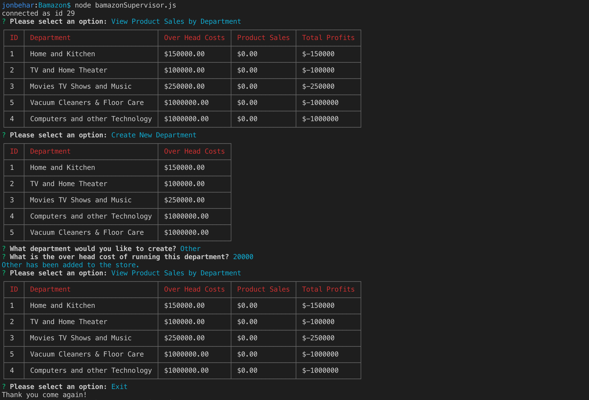

# Bamazon
Assignment 12 Node.js & MySQL - Bamazon

## Task
Creating an Amazon-like storefront with the MySQL skills you learned this unit. The app will take in orders from customers and deplete stock from the store's inventory. As a bonus task, you can program your app to track product sales across your store's departments and then provide a summary of the highest-grossing departments in the store.

## Before you begin

**Dotenv File Setup**
```
DATA_HOST=localhost
DATA_PORT=3306
DATA_USER=root
DATA_PASSWORD=insertyourpasswordhere
```

After setting up the .env file run the following node commands

```
npm init
npm install
```

## Start Application

Once installed you can run the following commands.

**To start the customer app** <br>
`node bamazonCustomer.js`

**To start the manager app** <br>
`node bamazonManager.js`

**To start the supervisor app** <br>
`node bamazonSupervisor.js`

## Demo
**bamazonCustomer App**

App Commands Used
```
node bamazonCustomer.js
393922
2
Y
393927
2
n
```
**bamazonCustomer App**


App Commands Used
```
node bamazonManager.js
View Products for Sale
Add New Product
The Lion King
19.99
2
View Low Inventory
Add To Inventory
393931
23
View Low Inventory
View Products for Sale
Exit
```

**bamazonSupervisor App**



## Concepts and Technologies
- Node.js, Command line application version 11.13.0
- NPM => Package.JSON version 6.10.1
- **dotenv**
- **inquirer** (Prompt)
- **mySQL**
- **cli-table**
- **chalk**
- ARRAY 
- For Loop
- IF ELSE statements 